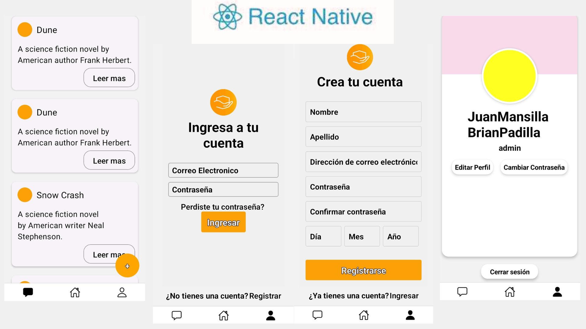

<h1 align="center">Hola, soy <a href="https://aristi.dev">Brian Padilla</a> 👋</h1>

## Sobre mi

- ⭐ Github Star ⭐
- 📲 FullStack developer
- 🥠Te enseño a programar apps en [Youtube](https://youtube.com/aristidevs?sub_confirmation=1)  
<!--
- ✏️ Y por escrito en [CursoKotlin](https://cursokotlin.com)
- 📗 Autor del libro [Iniciación a Android en Kotlin. Casos prácticos](https://www.paraninfo.es/catalogo/9788428340922/iniciacion-a-android-en-kotlin--casos-practicos)
- 🧑‍🏫 Creador de [AppCademy](https://appcademy.dev)
-->
✨ **Habilidades Tecnicas**   
  - React| React Native | redux | JavaScript | HTML5 | CSS3 | Nextjs
  - Node.js | express | MonguDB | postgresSQL | Nestjs
  - Jest | Jasmine | Vitest 
 

🔅**Teacher Asistant en Henry**  
  Voluntariado en cual se brinda un espacio a los aspirantes a *fullstack* para que puedan despejar sus dudas, resolucion de codigo, dinamicas de grupo en equipo 
 

💼**Experiencia**  
- 👨‍💻 Actualmente - Desarrollador de aplicaciones web en Nest , MongoDb y PostgreSQL  

Soy un apasionado del desarrollo de software con un viaje que comenzó en 2020. Mi enfoque autodidacta me ha llevado desde Java hasta explorar HTML, CSS y JavaScript para la creación de interfaces web. He ampliado mis habilidades en el desarrollo backend con PHP, React, Node.js y Express, y he incursionado con éxito en el desarrollo móvil utilizando React Native. Con experiencia en el diseño de aplicaciones de escritorio mediante Electron, mi perfil se destaca por la versatilidad. ¡Emocionado por contribuir en proyectos desafiantes y dinámicos! 🚀 ¡Explorando el código y construyendo soluciones innovadoras! 💻✨

 

## Proyectos destacados

<table>
<tr>
<td width="50%">
<h3 align="center">Temporizador - DNP</h3>

Este temporizador Fue creado para definir los tiempos, tiene acesos directos para 20, 15 y 5 minutos; Esta desarrollado en html,css y javascript por lo que sirve para la web pero gracias a electron tambien puede ser un programa para el escritorio.

                                                                                      
</td>

<td width="50%">
                
<h3 align="center">Calendario Jovenes Teen</h3>

                                       

 

Este calendario usa firebase para almacenar y hace las peticiones de las fechas, las muestra en un calendario echo con html,css y javascript, usa Moment para acceder a las fechas.

                                                             

 

<tr>
<td width="50%">
<h3 align="center">Mapa de Barrios</h3>

Esta web usa leaflet para visualizar los barrios y los lugares dentro de esos barrios, la aplicacion usa html,css, javascript

                                                                               
                                                                                      
</td>
<td width="50%">
<h3 align="center">Aplicación para la Iglesia DNP</h3>

Desarrollé la aplicación "Dios Nuestro Padre - Aplicación para la Iglesia DNP" con el objetivo de proporcionar a los miembros de la iglesia acceso rápido y fácil a devocionales, fechas importantes y funcionalidades de perfil. Utilizando tecnologías modernas como React Native y Express, creamos una plataforma intuitiva y centrada en el usuario que fomenta la conexión espiritual y comunitaria

</table>                                                                                 

                                                                                      
</td>

 
<h3 align="left">Languajes y herramientas</h3>

 
 
 
 
 

 

 
 
 
 
 
 

<h3 align="left">📬 Información de contacto</h3>
📧 padillabrian830@gmail.com

  

### ⚙️ &nbsp;GitHub Analytics

